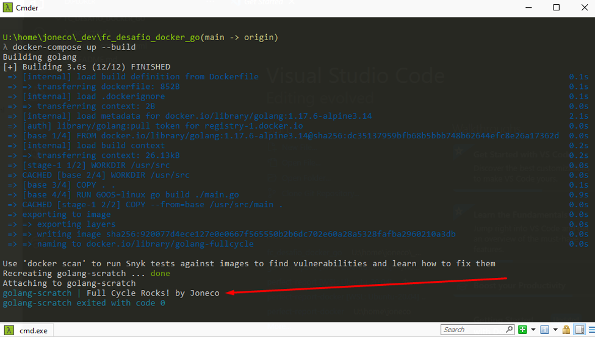
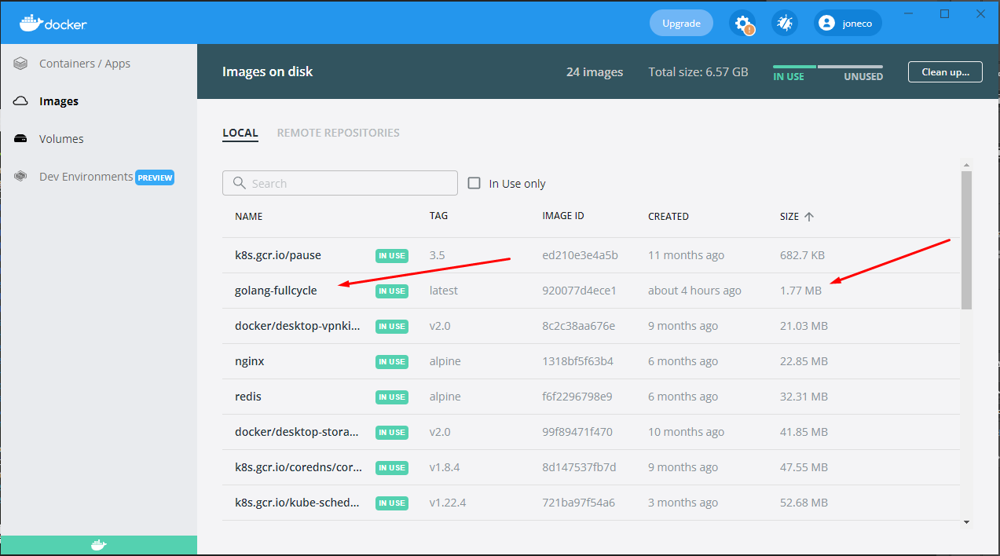

# fc_desafio_docker_go
desafio fullcycle

Imagem go com menos de 2mb.

Utilizei uma imagem alpine para compilar um programa em go.
Utilizei esse programa compilado e copiei o mesmo para uma outra imagem docker Scratch, para ela sim rodar a aplicacao go.

Pode-se rodar a imagem diretamento do docker-compose ou então buildando a imagem e depois utilizando o docker run

Passos DockerCompose:
1. Clonar Repositório
2. docker-compose up --build

Passos Docker Run:
1. Clonar Repositório
2. entrar na pasta go-scratch
3. docker build -t golang-fullcycle .
4. docker run --rm golang-fullcycle

Evidências:

